# Software Construction - Lab 3: Software Testing Techniques

**Course:** Software Construction  
**Department:** Computer Science - FCIS Mansoura University  
**Semester:** Fall 2025  
**Week:** 3

---

## 📋 Table of Contents

1. [Validation](#1-validation)
2. [Validation vs Verification](#2-validation-vs-verification)
3. [Perfect Quality in Software](#3-perfect-quality-in-software)
4. [Why Software Testing is Hard](#4-why-software-testing-is-hard)
5. [Test-First Programming](#5-test-first-programming)
6. [Software Testing Techniques](#6-software-testing-techniques)
7. [Black-box vs White-box Testing](#7-black-box-vs-white-box-testing)
8. [Specification-Based Techniques](#8-specification-based-techniques)
9. [Experience-Based Techniques](#9-experience-based-techniques)
10. [Choosing Test Cases by Partitioning](#10-choosing-test-cases-by-partitioning)
11. [Coverage](#11-coverage)
12. [Unit Testing and Integration Testing](#12-unit-testing-and-integration-testing)
13. [Lab Exercises](#13-lab-exercises)

---

## 1. Validation

### What is Validation?

Testing is an example of a more general process called **validation**. The purpose of validation is to uncover problems in a program and thereby increase your confidence in the program's correctness.

### Three Types of Validation


**1. Verification**
- Constructs a formal proof that a program is correct
- Tedious to do by hand
- Automated tool support for verification is still an active area of research

**2. Code Review**
- Having somebody else carefully read your code
- Reason informally about it
- Can be a good way to uncover bugs

**3. Testing**
- Running the program on carefully selected inputs
- Checking the results

---

## 2. Validation vs Verification


**Verification:** Are we building the product **RIGHT**?

**Validation:** Are we building the **RIGHT** product?

---

## 3. Perfect Quality in Software

Even with the best validation, it's very hard to achieve perfect quality in software.

### Typical Residual Defect Rates

Here are some typical residual defect rates (bugs left over after the software has shipped) per **kloc** (one thousand lines of source code):

| Quality Level | Defects per KLOC | Examples |
|--------------|------------------|----------|
| **1 - 10 defects/kloc** | Typical industry software | Most commercial software |
| **0.1 - 1 defects/kloc** | High-quality validation | Java libraries might achieve this |
| **0.01 - 0.1 defects/kloc** | Very best, safety-critical validation | NASA and companies like Praxis |


### The Reality

This can be discouraging for large systems. For example:
- If you have shipped **a million lines** of typical industry source code (1 defect/kloc)
- It means you **missed 1000 bugs!**

---

## 4. Why Software Testing is Hard

### Three Main Challenges


#### 1. Exhaustive Testing is Infeasible

The space of possible test cases is generally too big to cover exhaustively.

**Example:** Exhaustively testing a 32-bit floating-point multiply operation `a*b`
- There are **2^64 test cases!**
- This is computationally infeasible

#### 2. Haphazard Testing is Ineffective

**Haphazard testing** ("just try it and see if it works") is less likely to find bugs.
- It also doesn't increase our confidence in program correctness

#### 3. Random or Statistical Testing Doesn't Work Well for Software

Other engineering disciplines can:
- Test small random samples (e.g., 1% of hard drives manufactured)
- Infer the defect rate for the whole production lot
- Use many tricks to speed up time
    - Example: Opening a refrigerator 1000 times in 24 hours instead of 10 years

**Why these tricks don't work for software:**
- These tricks give known failure rates (e.g., mean lifetime of a hard drive)
- They assume **continuity or uniformity** across the space of defects
- This is true for **physical artifacts**
- But **NOT true for software** - bugs are discrete, not continuous

---

## 5. Test-First Programming

### The Testing Mindset


Testing requires having the **right attitude**:
- When you're **coding**, your goal is to make the program **work**
- But as a **tester**, you want to make it **fail**

You have to be **brutal**:
- A good tester wields a sledgehammer
- Beats the program everywhere it might be vulnerable
- So that those vulnerabilities can be eliminated

### Test Early and Often

**Don't leave testing until the end!**

It's far more pleasant to test your code as you develop it.

### The Test-First Programming Process


In test-first programming, you write tests **before** you even write any code.

**The development of a single function proceeds in this order:**

1. **Write a specification for the function**
2. **Write tests that exercise the specification**
3. **Write the actual code**
    - Once your code passes the tests you wrote, you're done!

### Why Test-First?

**The specification** describes the input and output behavior of the function:
- Gives the types of the parameters and any additional constraints
    - Example: `sqrt`'s parameter must be nonnegative
- Gives the type of the return value
- Describes how the return value relates to the inputs

**Writing tests first** is a good way to understand the specification:
- The specification can be buggy too
    - Incorrect, incomplete, ambiguous, missing corner cases
- Trying to write tests can uncover these problems **early**
- Before you've wasted time writing an implementation of a buggy spec

---

## 6. Software Testing Techniques

### What is a Software Testing Technique?

Software Testing Techniques help you **design better test cases**.

Since exhaustive testing is not possible, these techniques help:
- **Reduce** the number of test cases to be executed
- While **increasing** test coverage
- Identify test conditions that are otherwise difficult to recognize

### Three Types of Testing Techniques


---

## 7. Black-box vs White-box Testing

### Black-box Testing


**Blackbox testing** means choosing test cases **only from the specification**, not the implementation of the function.

- You test based on requirements and specifications
- You don't look at the code
- You don't know how it works internally

### White-box Testing (Glass Box Testing)


**Whitebox testing** (also called glass box testing) means choosing test cases **with knowledge of how the function is actually implemented**.

Examples:
- If the implementation selects different **algorithms** depending on the input
    - Then you should partition according to those domains
- If the implementation keeps an **internal cache** that remembers answers to previous inputs
    - Then you should test repeated inputs

### Important Note for White-box Testing

When doing whitebox testing, you must take care that your test cases **don't require specific implementation behavior** that isn't specifically called for by the spec.

**Example:**
- If the spec says "throws an exception if the input is poorly formatted"
- Your test **shouldn't** check specifically for a `NullPointerException` just because that's what the current implementation does
- The specification allows **any exception** to be thrown
- Your test case should likewise be general to preserve the implementor's freedom

---

## 8. Specification-Based Techniques

### 1. Boundary Value Analysis (BVA)

**Definition:** This technique is applied to explore errors at the **boundary** of the input domain.

**Purpose:** BVA catches any input errors that might interrupt with the proper functioning of the program.


**Key Idea:** Errors often occur at the boundaries of input ranges.

**Test at:**
- Minimum value
- Just above minimum
- Maximum value
- Just below maximum
- Invalid values (below min, above max)

### 2. Equivalence Partitioning (EP)

**Definition:** The test input data is partitioned into a number of classes having an equivalent number of data. Test cases are then designed for each class or partition.

**Purpose:** This helps to **reduce the number of test cases** while maintaining good coverage.


**Key Idea:** All values in one partition should behave the same way.
- Test one value from each partition
- If one test in a partition fails, others in that partition would likely fail too

### 3. Decision Table Testing

**Definition:** Test cases are designed on the basis of decision tables that are formulated using different combinations of inputs and their corresponding outputs based on various conditions and scenarios adhering to different business rules.

**Key Idea:** Systematically test all combinations of conditions.

**Example Structure:**

| Condition 1 | Condition 2 | Condition 3 | Expected Result |
|-------------|-------------|-------------|-----------------|
| True        | True        | True        | Action A        |
| True        | True        | False       | Action B        |
| True        | False       | True        | Action C        |
| ...         | ...         | ...         | ...             |

### 4. State Transition Diagrams

**Definition:** The software under test is perceived as a system having a finite number of states of different types. The transition from one state to another is guided by a set of rules.

**When to use:** This technique can be implemented on systems which have certain workflows within them.


**Key Idea:** Test the transitions between states, ensuring:
- Valid transitions work correctly
- Invalid transitions are rejected

---

## 9. Experience-Based Techniques

These techniques are **highly dependent on tester's experience** to understand the most important areas of the software.

The outcomes are based on the **skills, knowledge, and expertise** of the people involved.


### 1. Error Guessing

Testers **anticipate errors** based on:
- Their experience
- Availability of data
- Their knowledge of product failure

Error guessing is dependent on the:
- Skills
- Intuition
- Experience of the testers

### 2. Exploratory Testing

This technique is used to test the application **without any formal documentation**.

Characteristics:
- **Minimum time** available for testing
- **Maximum time** for test execution
- Test design and test execution are performed **concurrently**

---

## 10. Choosing Test Cases by Partitioning

### The Challenge

We can't test everything exhaustively, so we need to choose test cases intelligently.

### Example: BigInteger.multiply()

Let's look at an example. `BigInteger` is a class built into the Java library that can represent integers of any size (unlike primitive types `int` and `long` that have only limited ranges).

```java
/**
 * @param val another BigInteger
 * @return a BigInteger whose value is (this * val)
 */
public BigInteger multiply(BigInteger val)
```

**Usage Example:**
```java
BigInteger a = ...;
BigInteger b = ...;
BigInteger ab = a.multiply(b);
```

### Partitioning the Input Space

```mermaid
graph TD
    A[multiply function] --> B[Input Space:<br/>BigInteger × BigInteger]
    B --> C[Two-dimensional input space<br/>pairs of integers a, b]
```



**Function signature:** `multiply: BigInteger × BigInteger → BigInteger`

We have a **two-dimensional input space**, consisting of all pairs of integers `(a, b)`.

### Partitioning Strategy

Thinking about how multiplication works, we might start with these partitions:

#### 1. Sign Combinations


- **a and b are both positive**
- **a and b are both negative**
- **a is positive, b is negative**
- **a is negative, b is positive**

#### 2. Special Cases

There are also some special cases for multiplication that we should check:

**Special values: 0, 1, and -1**
- **a or b is 0**
- **a or b is 1**
- **a or b is -1**

#### 3. Size-Based Partitions

As a suspicious tester trying to find bugs, we might suspect that the implementor of `BigInteger` might:
- Try to make it faster by using `int` or `long` internally when possible
- Only fall back to an expensive general representation (like a list of digits) when the value is too big

So we should test:
- **a or b is small** (fits in standard integer types)
- **The absolute value of a or b is bigger than `Long.MAX_VALUE`**
    - The biggest possible primitive integer in Java, roughly 2^63

### Complete Partitioning


### Summary of Partitioning

By partitioning the input space intelligently:
- We identify **different classes** of inputs
- We select **representative test cases** from each class
- We achieve good coverage **without exhaustive testing**

---

## 11. Coverage

### What is Coverage?

**Coverage** is a metric that measures how much of your code is exercised by your test suite.

### Statement Coverage


**Statement coverage** measures the percentage of statements that have been executed.

**Example:**

```python
def absolute_value(x):
    if x < 0:           # Line 1
        x = -x          # Line 2
    return x            # Line 3
```

**Test with `x = 5`:**
- Executes lines: 1, 3
- **Does NOT execute**: line 2
- Coverage: **66%** (2 out of 3 statements)

**Test with `x = -5`:**
- Executes lines: 1, 2, 3
- Coverage: **100%**

### Branch Coverage

Branch coverage is stronger than statement coverage.

**Branch coverage** measures whether each decision point (if/else) has been tested in both directions (True and False).


**Example:**

```python
def classify(x):
    if x > 0:                    # Branch A
        if x % 2 == 0:           # Branch B
            return "positive even"
        else:
            return "positive odd"
    elif x < 0:                  # Branch C
        return "negative"
    else:
        return "zero"
```

For **100% branch coverage**, you need tests that cover:
- Branch A: True and False
- Branch B: True and False (when A is True)
- Branch C: True and False (when A is False)

### Path Coverage

**Path coverage** measures all possible paths through the code.

**Problem:** Path coverage is often impractical because the number of paths grows exponentially with the number of decisions.

### Coverage Goals


**Important:** 100% coverage does NOT mean bug-free code!
- Coverage only measures what was **executed**
- It doesn't guarantee the code is **correct**

---

## 12. Unit Testing and Integration Testing

### Unit Testing


**Definition:** A unit test is a test that tests an individual module (a method or a class) in **isolation** if possible.

**Why test in isolation?**
- Testing modules in isolation leads to much **easier debugging**
- When a unit test for a module fails, you can be more confident that the bug is **found in that module**
- Rather than anywhere in the program

### Using Stubs

A well-tested program will have tests for every individual module.

To test modules in isolation, you may need to use **stubs**:
- A **stub** is a simplified replacement for a dependency
- It allows you to test a module without requiring the real dependency

### Integration Testing

```mermaid
graph TD
    A[Module A] --> C[Integration Point]
    B[Module B] --> C
    C --> D[Module C]
    
    E[Integration Test] -.-> C
    
    style E fill:#e74c3c,stroke:#333,stroke-width:2px,color:#fff
```

**Definition:** An integration test tests a **combination of modules**, or even the entire program.

**Purpose:**
- Testing modules in isolation is not enough
- A program can fail at the **connections between modules**
- Example: One module may be expecting different inputs than it's actually getting from another module

### Unit Tests vs Integration Tests

```mermaid
graph TD
    A[Testing Strategy] --> B[Many Unit Tests]
    A --> C[Fewer Integration Tests]
    
    B --> B1[Fast execution]
    B --> B2[Easy debugging]
    B --> B3[Test individual logic]
    
    C --> C1[Slower execution]
    C --> C2[Harder debugging]
    C --> C3[Test interactions]
    
    style B fill:#2ecc71,stroke:#333,stroke-width:2px
    style C fill:#f39c12,stroke:#333,stroke-width:2px
```

**Best Practice:**
- Have a **thorough set of unit tests** that give you confidence in individual modules
- Then you'll have **much less searching** to do to find the bug when an integration test fails

**Comparison:**

| Aspect | Unit Test | Integration Test |
|--------|-----------|------------------|
| **Scope** | Single module | Multiple modules |
| **Speed** | Fast | Slower |
| **Debugging** | Easy | Harder |
| **When it fails** | Bug in this module | Bug could be anywhere |
| **Purpose** | Test logic | Test connections |

---

## 13. Lab Exercises

### Exercise 1: Implement Test-First Programming

**Problem:** Create a function `is_valid_password(password)` that validates passwords.

**Specification:**
```python
def is_valid_password(password):
    """
    Validates a password based on the following rules:
    - Minimum 8 characters
    - Must contain at least one uppercase letter
    - Must contain at least one lowercase letter
    - Must contain at least one digit
    
    Returns: (is_valid: bool, message: str)
    """
```

**Your Task:**
1. Write test cases FIRST (before implementation)
2. Then implement the function
3. Run tests and ensure they pass

---

### Exercise 2: Apply Boundary Value Analysis

**Problem:** Test a function `calculate_discount(age)` that returns discount percentage:
- Age 0-17: 20% discount
- Age 18-64: 0% discount
- Age 65+: 15% discount

**Your Task:**
1. Identify the boundaries
2. Design test cases using BVA
3. Test: below minimum, at minimum, just above minimum, etc.

---

### Exercise 3: Use Equivalence Partitioning

**Problem:** Test a function `classify_grade(score)`:
- 90-100: 'A'
- 80-89: 'B'
- 70-79: 'C'
- 60-69: 'D'
- Below 60: 'F'

**Your Task:**
1. Identify equivalence partitions
2. Select one representative test from each partition
3. Implement and test

---

### Exercise 4: Achieve Code Coverage

**Problem:** Given this function, write tests to achieve 100% branch coverage:

```python
def process_order(amount, is_member, has_coupon):
    discount = 0
    
    if is_member:
        discount = 10
    
    if has_coupon:
        discount += 5
    
    if amount > 100:
        discount += 5
    
    final_price = amount * (1 - discount/100)
    return final_price
```

**Your Task:**
1. Identify all branches
2. Design test cases to cover all branches
3. Calculate coverage percentage
4. Verify 100% branch coverage achieved

---

### Exercise 5: Unit Testing vs Integration Testing

**Problem:** You have three modules:
- `validate_input(data)` - validates user input
- `process_data(data)` - processes validated data
- `save_to_database(result)` - saves result

**Your Task:**
1. Write unit tests for each module (test in isolation using stubs)
2. Write integration tests for the complete workflow
3. Explain the difference in what each type of test verifies

---

## Summary

### Key Takeaways

```mermaid
mindmap
  root((Software Testing))
    Validation
      Verification
      Code Review
      Testing
    Test-First
      Write tests before code
      Increases confidence
      Finds spec bugs early
    Techniques
      Black-box: BVA, EP
      White-box: Coverage
      Experience-based
    Coverage
      Statement coverage
      Branch coverage
      Not a guarantee
    Testing Levels
      Unit tests: isolation
      Integration: connections
      Both needed
```

1. **Validation includes** verification, code review, and testing
2. **Test-first programming** helps find bugs early and improves design
3. **Black-box testing** uses only specification, **white-box** uses implementation knowledge
4. **Partitioning strategies** help choose good test cases efficiently
5. **Coverage measures** how much code is tested, but doesn't guarantee correctness
6. **Unit tests** are fast and focused, **integration tests** verify connections

### Remember

- **Exhaustive testing is impossible** - use smart strategies
- **Test early and often** - don't wait until the end
- **Be brutal when testing** - try to break your code
- **Use multiple techniques** - no single technique finds all bugs
- **Aim for high coverage** - but understand its limitations
- **Balance unit and integration tests** - both are important

---

**End of Lab 3 - Software Testing Techniques**

**FCIS Mansoura University - Fall 2025**