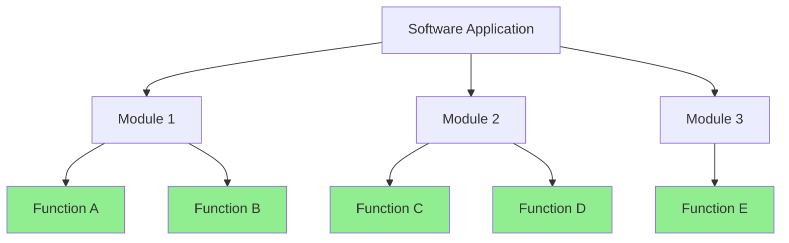
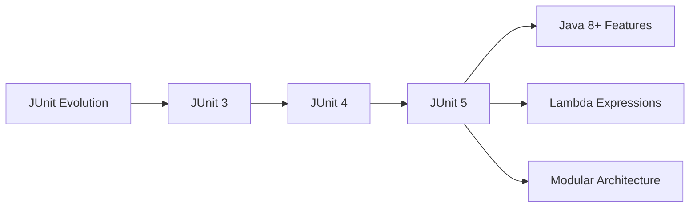
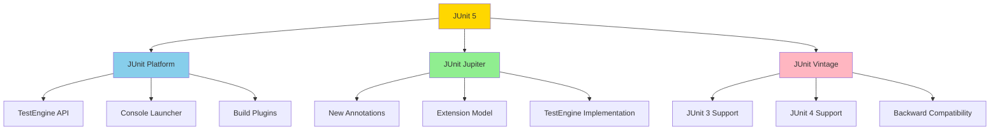
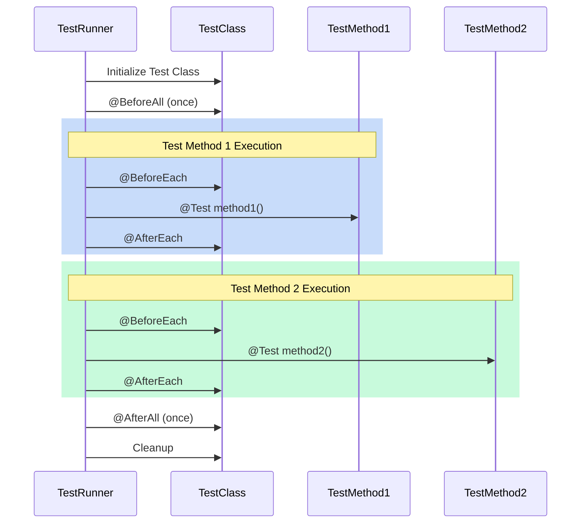
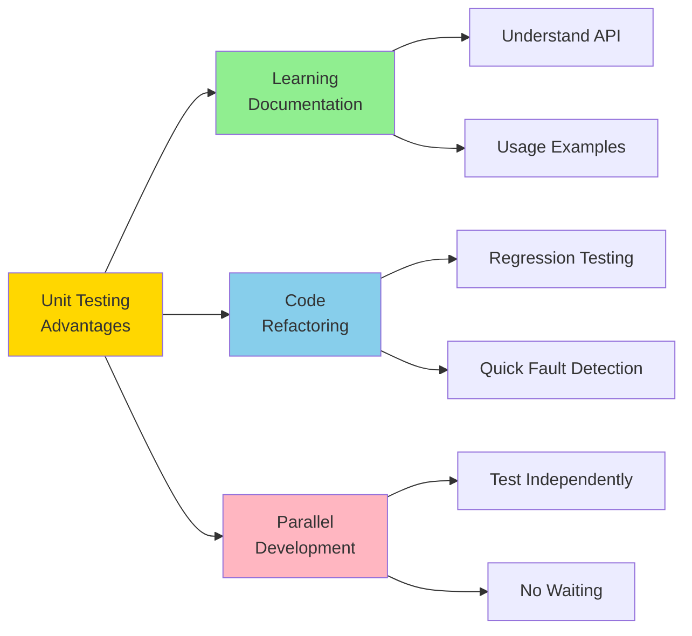
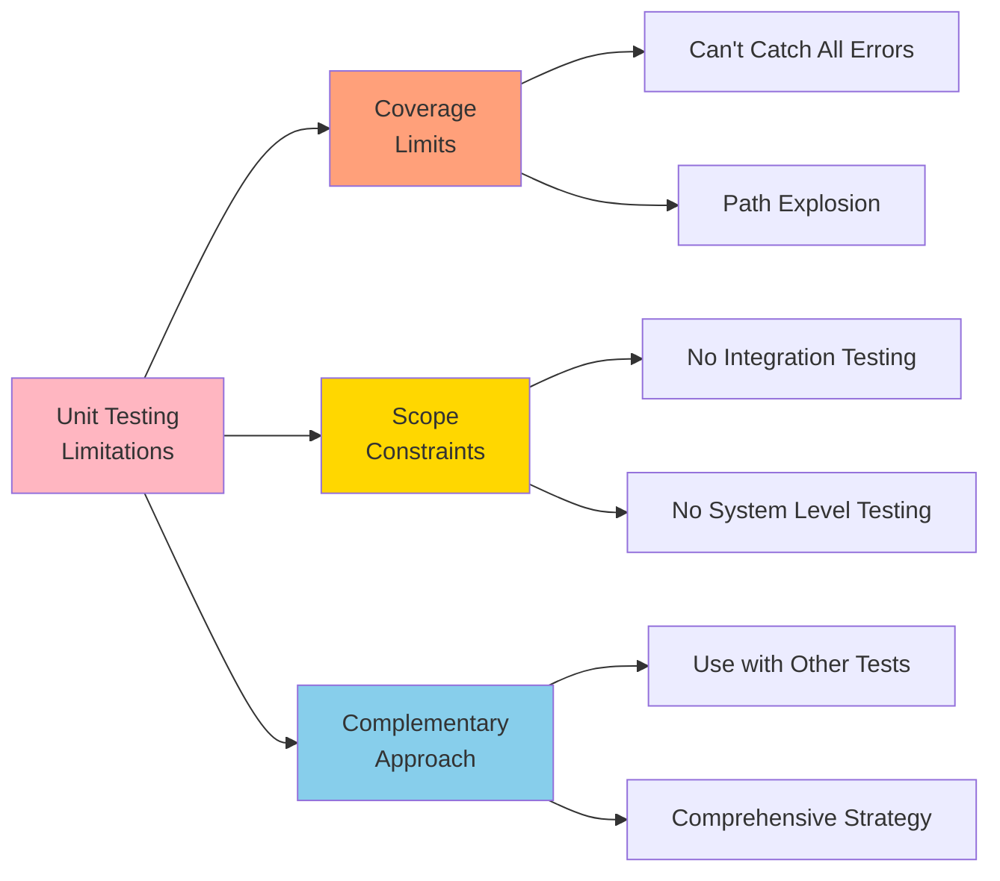

# Lab 4: Unit Testing with Java and JUnit 5

## Table of Contents
1. [Introduction to Unit Testing](#introduction-to-unit-testing)
2. [Unit Test Tools](#unit-test-tools)
3. [JUnit 5 Overview](#junit-5-overview)
4. [JUnit 5 Architecture](#junit-5-architecture)
5. [JUnit 5 Annotations](#junit-5-annotations)
6. [Test Lifecycle](#test-lifecycle)
7. [Practical Examples](#practical-examples)
8. [Advantages and Disadvantages](#advantages-and-disadvantages)

---

## Introduction to Unit Testing

**Unit Testing** is a type of software testing where individual units or components of a software are tested. The purpose is to validate that each unit of the software code performs as expected.

### Key Characteristics:
- **When**: Done during the development (coding phase) of an application by the developers
- **What**: Tests isolate a section of code and verify its correctness
- **Scope**: A unit may be an individual function, method, procedure, module, or object



---

## Unit Test Tools

There are several automated tools available to assist with unit testing:

### 1. **JUnit**
- Free testing tool for Java programming language
- Provides assertions to identify test methods
- Tests data first and then inserts it into the piece of code

### 2. **NUnit**
- Widely used unit-testing framework for all .NET languages
- Open source tool allowing manual script writing
- Supports data-driven tests that can run in parallel

### 3. **JMockit**
- Open source unit testing tool
- Code coverage tool with line and path metrics
- Allows mocking API with recording and verification syntax
- Offers Line coverage, Path Coverage, and Data Coverage

### 4. **EMMA**
- Open-source toolkit for analyzing and reporting Java code
- Supports coverage types: method, line, basic block
- Java-based without external library dependencies

### 5. **PHPUnit**
- Unit testing tool for PHP programmers
- Tests small code portions (units) separately
- Allows developers to use pre-defined assertion methods

---

## JUnit 5 Overview

**JUnit 5** is the most widely used testing framework for Java applications. It aims to adapt Java 8 style coding and incorporates features like lambda expressions.

### Requirements:
- **Java 8 or higher** is required to create and execute tests in JUnit 5
- Backward compatibility with JUnit 3 and JUnit 4 tests is maintained



---

## JUnit 5 Architecture

JUnit 5 is composed of several different modules from three different sub-projects:



### Components:

#### **JUnit Platform**
- Defines the `TestEngine` API for developing new testing frameworks
- Provides a Console Launcher to launch the platform from command line
- Includes build plugins for Gradle and Maven
- Enables IDEs, build tools, and plugins to include and extend platform APIs

#### **JUnit Jupiter**
- Contains new programming and extension models for writing tests
- Includes all new JUnit annotations
- Provides TestEngine implementation to run tests written with these annotations

#### **JUnit Vintage**
- Primary purpose is to support running JUnit 3 and JUnit 4 tests on JUnit 5 platform
- Ensures backward compatibility

---

## JUnit 5 Annotations

JUnit 5 provides several annotations to control test execution and lifecycle:

| Annotation | Description |
|------------|-------------|
| `@Test` | Marks a method as a test method |
| `@BeforeEach` | Executed before each test method |
| `@AfterEach` | Executed after each test method |
| `@BeforeAll` | Executed once before all test methods (must be static) |
| `@AfterAll` | Executed once after all test methods (must be static) |
| `@DisplayName` | Declares a custom display name for the test class or method |
| `@Disabled` | Disables a test class or method |
| `@RepeatedTest` | Repeats a test a specified number of times |
| `@ParameterizedTest` | Marks a method as a parameterized test |

---

## Test Lifecycle



---

## Practical Examples

### Example 1: Basic Calculator Class

First, let's create a simple Calculator class to test:

```java
// Calculator.java
public class Calculator {
    
    public int add(int a, int b) {
        return a + b;
    }
    
    public int subtract(int a, int b) {
        return a - b;
    }
    
    public int multiply(int a, int b) {
        return a * b;
    }
    
    public double divide(int a, int b) {
        if (b == 0) {
            throw new IllegalArgumentException("Cannot divide by zero");
        }
        return (double) a / b;
    }
    
    public boolean isEven(int number) {
        return number % 2 == 0;
    }
    
    public int factorial(int n) {
        if (n < 0) {
            throw new IllegalArgumentException("Factorial not defined for negative numbers");
        }
        if (n == 0 || n == 1) {
            return 1;
        }
        return n * factorial(n - 1);
    }
}
```

### Example 2: Basic Unit Tests

```java
// CalculatorTest.java
import org.junit.jupiter.api.*;
import static org.junit.jupiter.api.Assertions.*;

@DisplayName("Calculator Test Suite")
public class CalculatorTest {
    
    private Calculator calculator;
    
    @BeforeAll
    static void initAll() {
        System.out.println("Starting Calculator Tests...");
    }
    
    @BeforeEach
    void init() {
        calculator = new Calculator();
        System.out.println("Calculator instance created");
    }
    
    @AfterEach
    void tearDown() {
        calculator = null;
        System.out.println("Test completed\n");
    }
    
    @AfterAll
    static void tearDownAll() {
        System.out.println("All tests completed!");
    }
    
    @Test
    @DisplayName("Test Addition: 5 + 3 = 8")
    void testAddition() {
        int result = calculator.add(5, 3);
        assertEquals(8, result, "5 + 3 should equal 8");
    }
    
    @Test
    @DisplayName("Test Subtraction: 10 - 4 = 6")
    void testSubtraction() {
        int result = calculator.subtract(10, 4);
        assertEquals(6, result, "10 - 4 should equal 6");
    }
    
    @Test
    @DisplayName("Test Multiplication: 6 * 7 = 42")
    void testMultiplication() {
        int result = calculator.multiply(6, 7);
        assertEquals(42, result, "6 * 7 should equal 42");
    }
    
    @Test
    @DisplayName("Test Division: 20 / 4 = 5.0")
    void testDivision() {
        double result = calculator.divide(20, 4);
        assertEquals(5.0, result, 0.001, "20 / 4 should equal 5.0");
    }
    
    @Test
    @DisplayName("Test Division by Zero throws Exception")
    void testDivisionByZero() {
        Exception exception = assertThrows(
            IllegalArgumentException.class,
            () -> calculator.divide(10, 0),
            "Division by zero should throw IllegalArgumentException"
        );
        
        assertEquals("Cannot divide by zero", exception.getMessage());
    }
    
    @Test
    @DisplayName("Test Even Number: 4 is even")
    void testIsEven() {
        assertTrue(calculator.isEven(4), "4 should be even");
        assertFalse(calculator.isEven(5), "5 should not be even");
    }
    
    @Test
    @DisplayName("Test Factorial: 5! = 120")
    void testFactorial() {
        assertEquals(1, calculator.factorial(0), "0! should equal 1");
        assertEquals(1, calculator.factorial(1), "1! should equal 1");
        assertEquals(120, calculator.factorial(5), "5! should equal 120");
    }
    
    @Test
    @DisplayName("Test Negative Factorial throws Exception")
    void testNegativeFactorial() {
        assertThrows(
            IllegalArgumentException.class,
            () -> calculator.factorial(-5),
            "Negative factorial should throw exception"
        );
    }
}
```

### Example 3: String Utility Class and Tests

```java
// StringUtils.java
public class StringUtils {
    
    public String reverse(String input) {
        if (input == null) {
            throw new IllegalArgumentException("Input cannot be null");
        }
        return new StringBuilder(input).reverse().toString();
    }
    
    public boolean isPalindrome(String input) {
        if (input == null || input.isEmpty()) {
            return false;
        }
        String cleaned = input.replaceAll("\\s+", "").toLowerCase();
        return cleaned.equals(new StringBuilder(cleaned).reverse().toString());
    }
    
    public int countVowels(String input) {
        if (input == null) {
            return 0;
        }
        int count = 0;
        String vowels = "aeiouAEIOU";
        for (char c : input.toCharArray()) {
            if (vowels.indexOf(c) != -1) {
                count++;
            }
        }
        return count;
    }
    
    public String capitalize(String input) {
        if (input == null || input.isEmpty()) {
            return input;
        }
        return input.substring(0, 1).toUpperCase() + input.substring(1).toLowerCase();
    }
}
```

```java
// StringUtilsTest.java
import org.junit.jupiter.api.*;
import static org.junit.jupiter.api.Assertions.*;

@DisplayName("String Utilities Test Suite")
public class StringUtilsTest {
    
    private StringUtils stringUtils;
    
    @BeforeEach
    void setUp() {
        stringUtils = new StringUtils();
    }
    
    @Nested
    @DisplayName("Reverse String Tests")
    class ReverseTests {
        
        @Test
        @DisplayName("Reverse simple string")
        void testReverseSimple() {
            assertEquals("olleH", stringUtils.reverse("Hello"));
        }
        
        @Test
        @DisplayName("Reverse empty string")
        void testReverseEmpty() {
            assertEquals("", stringUtils.reverse(""));
        }
        
        @Test
        @DisplayName("Reverse null string throws exception")
        void testReverseNull() {
            assertThrows(IllegalArgumentException.class, 
                () -> stringUtils.reverse(null));
        }
    }
    
    @Nested
    @DisplayName("Palindrome Tests")
    class PalindromeTests {
        
        @Test
        @DisplayName("Check palindrome: racecar")
        void testPalindromeTrue() {
            assertTrue(stringUtils.isPalindrome("racecar"));
        }
        
        @Test
        @DisplayName("Check palindrome with spaces: A man a plan a canal Panama")
        void testPalindromeWithSpaces() {
            assertTrue(stringUtils.isPalindrome("A man a plan a canal Panama"));
        }
        
        @Test
        @DisplayName("Check non-palindrome: hello")
        void testPalindromeFalse() {
            assertFalse(stringUtils.isPalindrome("hello"));
        }
        
        @Test
        @DisplayName("Check empty string is not palindrome")
        void testPalindromeEmpty() {
            assertFalse(stringUtils.isPalindrome(""));
        }
    }
    
    @Nested
    @DisplayName("Count Vowels Tests")
    class VowelTests {
        
        @Test
        @DisplayName("Count vowels in 'education'")
        void testCountVowels() {
            assertEquals(5, stringUtils.countVowels("education"));
        }
        
        @Test
        @DisplayName("Count vowels in string with no vowels")
        void testCountVowelsNone() {
            assertEquals(0, stringUtils.countVowels("xyz"));
        }
        
        @Test
        @DisplayName("Count vowels in null string")
        void testCountVowelsNull() {
            assertEquals(0, stringUtils.countVowels(null));
        }
    }
    
    @Nested
    @DisplayName("Capitalize Tests")
    class CapitalizeTests {
        
        @Test
        @DisplayName("Capitalize lowercase string")
        void testCapitalizeLowercase() {
            assertEquals("Hello", stringUtils.capitalize("hello"));
        }
        
        @Test
        @DisplayName("Capitalize uppercase string")
        void testCapitalizeUppercase() {
            assertEquals("Hello", stringUtils.capitalize("HELLO"));
        }
        
        @Test
        @DisplayName("Capitalize empty string")
        void testCapitalizeEmpty() {
            assertEquals("", stringUtils.capitalize(""));
        }
        
        @Test
        @DisplayName("Capitalize null string")
        void testCapitalizeNull() {
            assertNull(stringUtils.capitalize(null));
        }
    }
}
```

### Example 4: Parameterized Tests

```java
// ParameterizedCalculatorTest.java
import org.junit.jupiter.api.DisplayName;
import org.junit.jupiter.params.ParameterizedTest;
import org.junit.jupiter.params.provider.*;
import static org.junit.jupiter.api.Assertions.*;

import java.util.stream.Stream;

@DisplayName("Parameterized Calculator Tests")
public class ParameterizedCalculatorTest {
    
    @ParameterizedTest(name = "{0} + {1} = {2}")
    @CsvSource({
        "1, 2, 3",
        "5, 7, 12",
        "10, 20, 30",
        "-5, 5, 0",
        "100, 200, 300"
    })
    @DisplayName("Test Addition with Multiple Inputs")
    void testAdditionWithCsvSource(int a, int b, int expected) {
        Calculator calculator = new Calculator();
        assertEquals(expected, calculator.add(a, b));
    }
    
    @ParameterizedTest(name = "Number {0} is even: {1}")
    @CsvSource({
        "2, true",
        "3, false",
        "4, true",
        "5, false",
        "10, true",
        "15, false"
    })
    @DisplayName("Test Even Numbers")
    void testIsEvenWithCsvSource(int number, boolean expected) {
        Calculator calculator = new Calculator();
        assertEquals(expected, calculator.isEven(number));
    }
    
    @ParameterizedTest(name = "{0}! = {1}")
    @MethodSource("factorialProvider")
    @DisplayName("Test Factorial with Method Source")
    void testFactorialWithMethodSource(int input, int expected) {
        Calculator calculator = new Calculator();
        assertEquals(expected, calculator.factorial(input));
    }
    
    static Stream<Arguments> factorialProvider() {
        return Stream.of(
            Arguments.of(0, 1),
            Arguments.of(1, 1),
            Arguments.of(2, 2),
            Arguments.of(3, 6),
            Arguments.of(4, 24),
            Arguments.of(5, 120)
        );
    }
    
    @ParameterizedTest(name = "Divide {0} by {1} = {2}")
    @CsvSource({
        "10, 2, 5.0",
        "20, 4, 5.0",
        "15, 3, 5.0",
        "7, 2, 3.5",
        "9, 4, 2.25"
    })
    @DisplayName("Test Division with Multiple Inputs")
    void testDivisionWithCsvSource(int dividend, int divisor, double expected) {
        Calculator calculator = new Calculator();
        assertEquals(expected, calculator.divide(dividend, divisor), 0.001);
    }
}
```

### Example 5: Testing with Repeated Tests

```java
// RepeatedCalculatorTest.java
import org.junit.jupiter.api.*;
import static org.junit.jupiter.api.Assertions.*;
import java.util.Random;

@DisplayName("Repeated Calculator Tests")
public class RepeatedCalculatorTest {
    
    private Calculator calculator;
    private Random random;
    
    @BeforeEach
    void setUp() {
        calculator = new Calculator();
        random = new Random();
    }
    
    @RepeatedTest(value = 5, name = "Repetition {currentRepetition} of {totalRepetitions}")
    @DisplayName("Test Addition Commutative Property")
    void testAdditionCommutative(RepetitionInfo repetitionInfo) {
        int a = random.nextInt(100);
        int b = random.nextInt(100);
        
        System.out.println("Repetition " + repetitionInfo.getCurrentRepetition() + 
                         ": Testing " + a + " + " + b);
        
        assertEquals(calculator.add(a, b), calculator.add(b, a),
            "Addition should be commutative");
    }
    
    @RepeatedTest(3)
    @DisplayName("Test Multiplication Identity")
    void testMultiplicationIdentity() {
        int number = random.nextInt(100);
        assertEquals(number, calculator.multiply(number, 1),
            "Multiplying by 1 should return the same number");
    }
    
    @RepeatedTest(3)
    @DisplayName("Test Addition Identity")
    void testAdditionIdentity() {
        int number = random.nextInt(100);
        assertEquals(number, calculator.add(number, 0),
            "Adding 0 should return the same number");
    }
}
```

### Example 6: Common Assertions

```java
// AssertionsExampleTest.java
import org.junit.jupiter.api.Test;
import org.junit.jupiter.api.DisplayName;
import static org.junit.jupiter.api.Assertions.*;
import java.time.Duration;
import java.util.Arrays;
import java.util.List;

@DisplayName("JUnit 5 Assertions Examples")
public class AssertionsExampleTest {
    
    @Test
    @DisplayName("Equality Assertions")
    void testEquality() {
        // Basic equality
        assertEquals(5, 2 + 3);
        assertEquals("Hello", "Hello");
        
        // With custom message
        assertEquals(10, 5 * 2, "5 * 2 should equal 10");
        
        // Double comparison with delta
        assertEquals(3.14, 3.141, 0.01, "Pi approximation");
    }
    
    @Test
    @DisplayName("Boolean Assertions")
    void testBooleans() {
        assertTrue(5 > 3, "5 should be greater than 3");
        assertFalse(5 < 3, "5 should not be less than 3");
    }
    
    @Test
    @DisplayName("Null Assertions")
    void testNull() {
        String nullString = null;
        String nonNullString = "Hello";
        
        assertNull(nullString, "String should be null");
        assertNotNull(nonNullString, "String should not be null");
    }
    
    @Test
    @DisplayName("Array Assertions")
    void testArrays() {
        int[] expected = {1, 2, 3, 4, 5};
        int[] actual = {1, 2, 3, 4, 5};
        
        assertArrayEquals(expected, actual, "Arrays should be equal");
    }
    
    @Test
    @DisplayName("Collection Assertions")
    void testCollections() {
        List<String> fruits = Arrays.asList("Apple", "Banana", "Orange");
        
        assertEquals(3, fruits.size());
        assertTrue(fruits.contains("Banana"));
        assertFalse(fruits.contains("Grape"));
    }
    
    @Test
    @DisplayName("Same vs Equals")
    void testSameVsEquals() {
        String a = new String("test");
        String b = new String("test");
        String c = a;
        
        assertEquals(a, b, "Strings have same content");
        assertNotSame(a, b, "Strings are different objects");
        assertSame(a, c, "Strings reference same object");
    }
    
    @Test
    @DisplayName("Exception Assertions")
    void testExceptions() {
        Calculator calculator = new Calculator();
        
        // Assert that exception is thrown
        assertThrows(IllegalArgumentException.class, 
            () -> calculator.divide(10, 0));
        
        // Capture and verify exception
        Exception exception = assertThrows(IllegalArgumentException.class,
            () -> calculator.factorial(-5));
        assertEquals("Factorial not defined for negative numbers", 
            exception.getMessage());
    }
    
    @Test
    @DisplayName("Timeout Assertions")
    void testTimeout() {
        // Assert that operation completes within timeout
        assertTimeout(Duration.ofMillis(100), () -> {
            Thread.sleep(50);
        }, "Operation should complete within 100ms");
    }
    
    @Test
    @DisplayName("Grouped Assertions")
    void testGroupedAssertions() {
        Calculator calculator = new Calculator();
        
        assertAll("Calculator Operations",
            () -> assertEquals(8, calculator.add(5, 3)),
            () -> assertEquals(2, calculator.subtract(5, 3)),
            () -> assertEquals(15, calculator.multiply(5, 3)),
            () -> assertEquals(1.666, calculator.divide(5, 3), 0.001)
        );
    }
}
```

### Example 7: Test Execution Order

```java
// OrderedCalculatorTest.java
import org.junit.jupiter.api.*;
import static org.junit.jupiter.api.Assertions.*;

@TestMethodOrder(MethodOrderer.OrderAnnotation.class)
@DisplayName("Ordered Test Execution Example")
public class OrderedCalculatorTest {
    
    private static Calculator calculator;
    private static int testCounter = 0;
    
    @BeforeAll
    static void initAll() {
        calculator = new Calculator();
        System.out.println("Test suite started\n");
    }
    
    @Test
    @Order(1)
    @DisplayName("First Test: Basic Addition")
    void test1_Addition() {
        testCounter++;
        System.out.println("Executing test " + testCounter);
        assertEquals(5, calculator.add(2, 3));
    }
    
    @Test
    @Order(2)
    @DisplayName("Second Test: Basic Subtraction")
    void test2_Subtraction() {
        testCounter++;
        System.out.println("Executing test " + testCounter);
        assertEquals(2, calculator.subtract(5, 3));
    }
    
    @Test
    @Order(3)
    @DisplayName("Third Test: Basic Multiplication")
    void test3_Multiplication() {
        testCounter++;
        System.out.println("Executing test " + testCounter);
        assertEquals(15, calculator.multiply(3, 5));
    }
    
    @Test
    @Order(4)
    @DisplayName("Fourth Test: Basic Division")
    void test4_Division() {
        testCounter++;
        System.out.println("Executing test " + testCounter);
        assertEquals(2.5, calculator.divide(5, 2), 0.001);
    }
    
    @AfterAll
    static void tearDownAll() {
        System.out.println("\nTotal tests executed: " + testCounter);
    }
}
```

---

## Advantages and Disadvantages

### Advantages



1. **Learning and Documentation**
   - Developers can learn functionality by examining unit tests
   - Unit tests serve as basic documentation for the unit API
   - Provides usage examples for other developers

2. **Code Refactoring and Maintenance**
   - Enables safe refactoring with confidence
   - Regression testing ensures modules work correctly after changes
   - Quickly identifies and fixes faults when changes are made

3. **Parallel Development**
   - Due to modular nature, parts can be tested without waiting for others
   - Enables independent development and testing of components
   - Reduces development time and dependencies

### Disadvantages



1. **Coverage Limitations**
   - Cannot catch every error in a program
   - Impossible to evaluate all execution paths, even in trivial programs
   - Some edge cases may remain untested

2. **Scope Constraints**
   - Focuses on individual units by nature
   - Cannot catch integration errors between components
   - Cannot detect broad system-level errors

3. **Need for Complementary Testing**
   - Should be used in conjunction with other testing activities
   - Integration testing still required
   - System testing and acceptance testing remain necessary

---

## Running Tests

### Maven Configuration

Add the following dependency to your `pom.xml`:

```xml
<dependencies>
    <dependency>
        <groupId>org.junit.jupiter</groupId>
        <artifactId>junit-jupiter</artifactId>
        <version>5.10.0</version>
        <scope>test</scope>
    </dependency>
</dependencies>

<build>
    <plugins>
        <plugin>
            <groupId>org.apache.maven.plugins</groupId>
            <artifactId>maven-surefire-plugin</artifactId>
            <version>3.0.0</version>
        </plugin>
    </plugins>
</build>
```

### Gradle Configuration

Add to your `build.gradle`:

```gradle
dependencies {
    testImplementation 'org.junit.jupiter:junit-jupiter:5.10.0'
}

test {
    useJUnitPlatform()
}
```

### Running Tests from Command Line

**Maven:**
```bash
mvn test
```

**Gradle:**
```bash
gradle test
```

### Running Tests from IDE

Most modern IDEs (IntelliJ IDEA, Eclipse, VS Code) have built-in support for JUnit 5:
- Right-click on test class → Run
- Use keyboard shortcuts (Ctrl+Shift+F10 in IntelliJ)
- Click the green play button next to test methods

---

## Best Practices

1. **Test Naming**: Use descriptive names that explain what is being tested
2. **One Assertion Per Test**: Focus each test on a single behavior (when possible)
3. **Arrange-Act-Assert Pattern**: 
   - Arrange: Set up test data
   - Act: Execute the method being tested
   - Assert: Verify the results
4. **Independent Tests**: Tests should not depend on each other
5. **Fast Execution**: Tests should run quickly
6. **Repeatable**: Tests should produce same results every time
7. **Use @DisplayName**: Provide clear, readable test descriptions
8. **Test Edge Cases**: Include boundary values and error conditions
9. **Keep Tests Simple**: Tests should be easier to understand than the code they test
10. **Clean Up**: Use @AfterEach and @AfterAll appropriately

---

## Summary

In this lab, you learned:
- The fundamentals of unit testing and its importance
- Various unit testing tools available for different programming languages
- JUnit 5 architecture and its three main components
- Essential JUnit 5 annotations and their usage
- Test lifecycle and execution order
- How to write effective unit tests with practical examples
- Advantages and limitations of unit testing

Unit testing is a critical practice in modern software development that helps ensure code quality, facilitates refactoring, and serves as living documentation for your codebase.

---

## Exercise

Create a `BankAccount` class with the following features:
- Deposit money
- Withdraw money
- Get balance
- Transfer money to another account
- Calculate interest

Write comprehensive unit tests covering:
1. Normal operations
2. Edge cases (zero amounts, negative amounts)
3. Exception handling (insufficient funds, invalid inputs)
4. Parameterized tests for various deposit/withdrawal amounts
5. Test the transfer functionality between two accounts

Good luck! 🚀
