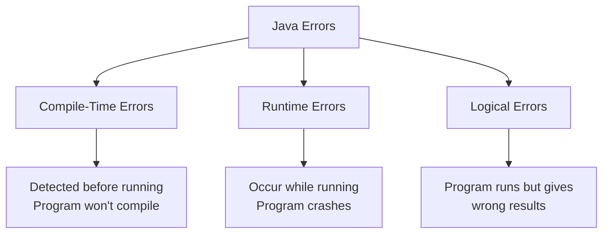
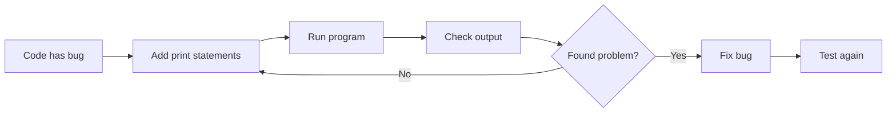
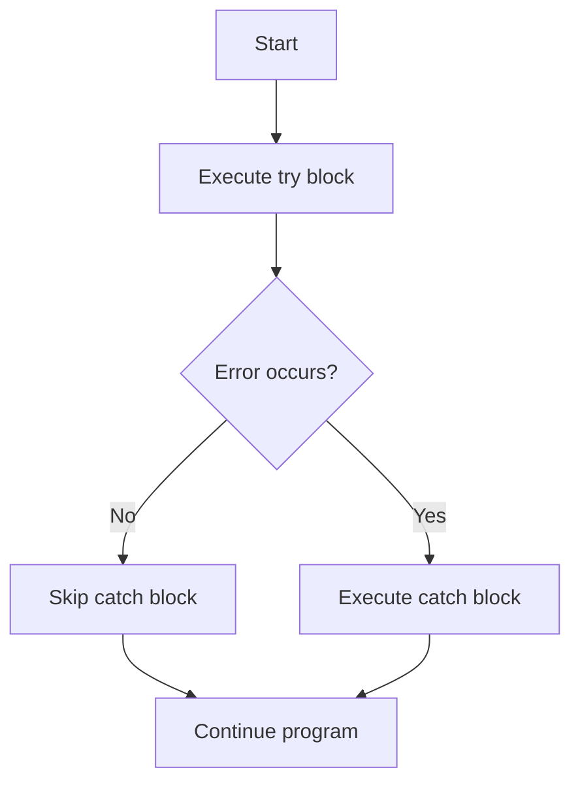
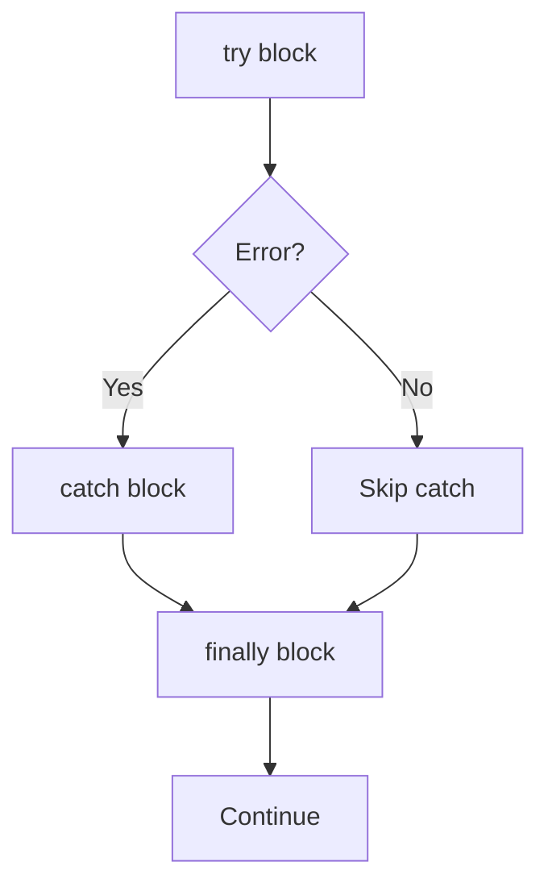
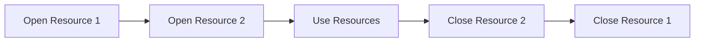
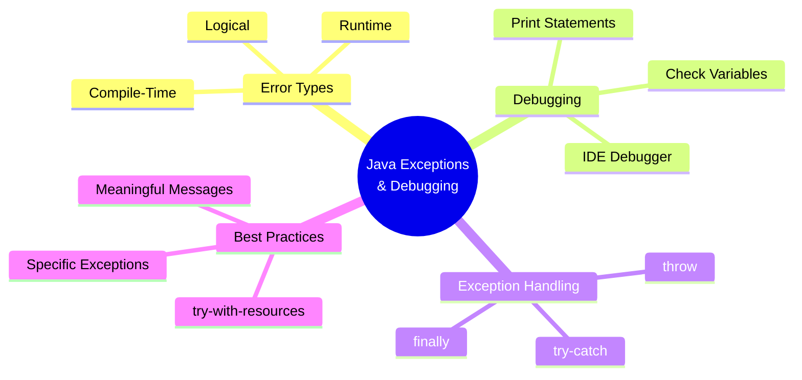

# Java Exceptions and Debugging Lab

## Introduction

Welcome to the Java Exceptions and Debugging lab! In this lab, you will learn how to:
- Understand different types of errors in Java
- Debug your code using simple techniques
- Handle exceptions to prevent program crashes
- Use try-catch blocks effectively

---

## Part 1: Understanding Errors

### What Are Errors?

Errors are problems in your code that prevent it from working correctly. There are three main types:



### Types of Errors

| Error Type | When It Happens | Example |
|------------|----------------|---------|
| **Compile-Time** | Before the program runs | Missing semicolon, undeclared variable |
| **Runtime** | While the program is running | Division by zero, array index out of bounds |
| **Logical** | Program runs but result is wrong | Using `x - y` instead of `x + y` |

---

## Part 2: Common Errors

### Compile-Time Errors

These errors prevent your code from compiling.

#### 1. Missing Semicolon

```java
int x = 5  // Error: ';' expected
```

**Solution:** Add semicolon at the end
```java
int x = 5;
```

#### 2. Undeclared Variable

```java
System.out.println(myVar);  // Error: cannot find symbol
```

**Solution:** Declare the variable first
```java
int myVar = 50;
System.out.println(myVar);
```

#### 3. Type Mismatch

```java
int x = "Hello";  // Error: incompatible types
```

**Solution:** Use correct type
```java
String x = "Hello";
```

### Runtime Errors

These errors occur when the program is running.

#### 1. Division by Zero

```java
int x = 10;
int y = 0;
int result = x / y;  // ArithmeticException
```

**Output:**
```
Exception in thread "main" java.lang.ArithmeticException: / by zero
```

#### 2. Array Index Out of Bounds

```java
int[] numbers = {1, 2, 3};
System.out.println(numbers[10]);  // ArrayIndexOutOfBoundsException
```

**Output:**
```
Exception in thread "main" java.lang.ArrayIndexOutOfBoundsException: 10
```

### Logical Errors

These are the hardest to find because the program runs without crashing.

```java
int x = 10;
int y = 2;
int result = x - y;  // You meant x + y
System.out.println(result);  // Prints 8 instead of 12
```

---

## Part 3: Debugging Basics

### What is Debugging?

**Debugging** is finding and fixing errors in your code.



### Using Print Statements

The simplest way to debug is using `System.out.println()`.

```java
int x = 10;
int y = 0;

System.out.println("Before division");  // This prints
System.out.println("x = " + x);         // This prints
System.out.println("y = " + y);         // This prints

int result = x / y;  // Program crashes here

System.out.println("Result: " + result);  // Never runs
```

**Output:**
```
Before division
x = 10
y = 0
Exception in thread "main" java.lang.ArithmeticException: / by zero
```

### Debugging Checklist

✅ Read the full error message  
✅ Check if all variables are initialized  
✅ Print variable values to trace the problem  
✅ Watch for off-by-one errors in loops  
✅ Test with different inputs

---

## Part 4: Exception Handling

### What Are Exceptions?

When an error occurs, Java throws an **exception** (an error object). Without handling it, your program crashes.

### The try-catch Block

Use `try-catch` to handle exceptions gracefully.



**Syntax:**
```java
try {
    // Code that might cause an error
} catch (Exception e) {
    // Code to handle the error
}
```

### Example: Handling Array Index Error

**Without try-catch (program crashes):**
```java
public class Main {
    public static void main(String[] args) {
        int[] myNumbers = {1, 2, 3};
        System.out.println(myNumbers[10]);  // Crash!
    }
}
```

**Output:**
```
Exception in thread "main" java.lang.ArrayIndexOutOfBoundsException: 10
```

**With try-catch (program continues):**
```java
public class Main {
    public static void main(String[] args) {
        try {
            int[] myNumbers = {1, 2, 3};
            System.out.println(myNumbers[10]);
        } catch (Exception e) {
            System.out.println("Something went wrong.");
        }
    }
}
```

**Output:**
```
Something went wrong.
```

---

## Part 5: The finally Block

The `finally` block runs **always**, whether an error occurred or not.

```java
try {
    int[] myNumbers = {1, 2, 3};
    System.out.println(myNumbers[10]);
} catch (Exception e) {
    System.out.println("Something went wrong.");
} finally {
    System.out.println("The 'try catch' is finished.");
}
```

**Output:**
```
Something went wrong.
The 'try catch' is finished.
```



---

## Part 6: The throw Keyword

You can create your own exceptions using `throw`.

### Example: Age Validation

```java
public class Main {
    static void checkAge(int age) {
        if (age < 18) {
            throw new ArithmeticException("Access denied - You must be at least 18 years old.");
        } else {
            System.out.println("Access granted - You are old enough!");
        }
    }

    public static void main(String[] args) {
        checkAge(15);  // Will throw exception
    }
}
```

**Output:**
```
Exception in thread "main" java.lang.ArithmeticException: Access denied - You must be at least 18 years old.
```

### Using throw with try-catch

```java
public class Main {
    static void checkAge(int age) {
        if (age < 18) {
            throw new ArithmeticException("Access denied - You must be at least 18 years old.");
        } else {
            System.out.println("Access granted - You are old enough!");
        }
    }

    public static void main(String[] args) {
        try {
            checkAge(15);
        } catch (Exception e) {
            System.out.println("Error: " + e.getMessage());
        }
    }
}
```

**Output:**
```
Error: Access denied - You must be at least 18 years old.
```

---

## Part 7: Try-with-Resources

### The Problem with Manual Resource Management

When working with files or streams, you need to close them manually:

```java
import java.io.FileOutputStream;

public class Main {
    public static void main(String[] args) {
        FileOutputStream fos = null;
        try {
            fos = new FileOutputStream("output.txt");
            fos.write("Hello".getBytes());
        } catch (Exception e) {
            e.printStackTrace();
        } finally {
            try {
                if (fos != null) fos.close();  // Manual closing
            } catch (Exception e) {
                e.printStackTrace();
            }
        }
    }
}
```

### The Solution: try-with-resources

Java 7 introduced `try-with-resources` to automatically close resources.

**Syntax:**
```java
try (ResourceType resource = new ResourceType()) {
    // Use the resource
}
// Resource is automatically closed here
```

**Example:**
```java
import java.io.FileOutputStream;

public class Main {
    public static void main(String[] args) {
        try (FileOutputStream fos = new FileOutputStream("output.txt")) {
            fos.write("Hello".getBytes());
        } catch (Exception e) {
            e.printStackTrace();
        }
        // No need to close fos - Java does it automatically!
    }
}
```

### Multiple Resources

You can manage multiple resources at once:

```java
import java.io.FileWriter;
import java.io.BufferedWriter;

public class Main {
    public static void main(String[] args) {
        try (FileWriter fw = new FileWriter("output.txt");
             BufferedWriter bw = new BufferedWriter(fw)) {
            bw.write("Hello World!");
        } catch (Exception e) {
            e.printStackTrace();
        }
        // Both resources are automatically closed in reverse order
    }
}
```



**Benefits:**
- ✅ Cleaner code - no manual `close()` calls
- ✅ Safer - resources are closed even if an exception occurs
- ✅ Automatic - Java handles closing for you

**Rule of thumb:** When working with files, streams, or database connections, always use try-with-resources!

---

## Lab Exercises

### Exercise 1: Fix Compile-Time Errors

Find and fix the errors in this code:

```java
public class Main {
    public static void main(String[] args) {
        int age = 25
        String name
        System.out.println("Name: " + name);
        System.out.println("Age: " + age);
    }
}
```

### Exercise 2: Handle Runtime Errors

Modify this code to handle the division by zero error:

```java
public class Main {
    public static void main(String[] args) {
        int[] numbers = {10, 20, 30};
        int divisor = 0;
        
        int result = numbers[0] / divisor;
        System.out.println("Result: " + result);
    }
}
```

### Exercise 3: Create Custom Exception

Write a program that:
1. Takes a number as input
2. Throws an exception if the number is negative
3. Catches and handles the exception properly

### Exercise 4: Use try-with-resources

Write a program that:
1. Creates a file called "student.txt"
2. Writes your name and student ID to the file
3. Uses try-with-resources to ensure the file is closed properly

---

## Common Exception Types

| Exception | Cause |
|-----------|-------|
| `ArithmeticException` | Division by zero |
| `ArrayIndexOutOfBoundsException` | Invalid array index |
| `NullPointerException` | Using a null object |
| `FileNotFoundException` | File doesn't exist |
| `NumberFormatException` | Invalid string to number conversion |

---

## Summary



### Key Takeaways

1. **Errors happen** - even to experienced programmers
2. **Debug systematically** - use print statements and debuggers
3. **Handle exceptions** - use try-catch to prevent crashes
4. **Close resources** - use try-with-resources for files and streams
5. **Test thoroughly** - try different inputs to find bugs

### Next Steps

- Practice writing try-catch blocks for different scenarios
- Learn about specific exception types
- Explore IDE debugging tools (IntelliJ IDEA, Eclipse, NetBeans)
- Study exception hierarchies in Java

---

## Additional Resources

- Java Exception Documentation: https://docs.oracle.com/javase/tutorial/essential/exceptions/
- Practice debugging techniques with your IDE
- Review the error messages - they often tell you exactly what's wrong!

---

**Good luck with your lab exercises! Remember: the more you debug, the better you get at spotting and fixing problems quickly.**
